  

# 🚀 Awesome Datacenter Management Suite

  
  
  
  
  
  

---

## 📌 Overview & SEO Summary

**Curated List of Commercial SaaS Platforms & Open-Source GitHub Projects for Enterprise Datacenter Infrastructure**

*Focusing on Datacenter Orchestration, DCIM (Data Center Infrastructure Management), Server Infrastructure Monitoring, Bare-Metal Provisioning, AIOps, and Cloud Operations.*

**Last updated: October 2026** 📅

This repository tracks top-tier **commercial enterprise software** and **production-grade open-source GitHub projects** designed for modern **Datacenter Management**. These solutions empower datacenter operators, cloud architects, sysadmins, and DevOps engineers to orchestrate virtual machines (VMs), manage physical rack inventory/IPAM, monitor server hardware performance via SNMP/IPMI, and automate multi-cloud infrastructure seamlessly.

---

## 📖 Table of Contents

- [📊 Market Overview & Industry Analysis](#-market-overview--industry-analysis)
- [💼 Commercial Platforms](#-commercial-platforms)
- [🔓 Open-Source GitHub Projects](#-open-source-github-projects)
- [🤝 How to Contribute](#-how-to-contribute)
- [💖 Support & Sponsorship](#-support--sponsorship)
- [⚠️ Disclaimer](#-disclaimer)
- [📈 Star History](#-star-history)

---

## 📊 Market Overview & Industry Analysis

> **💡 Estimated Market Size & Dynamics**: The global Datacenter Management & DCIM market is estimated at **$18.5 Billion to $24 Billion (2025–2026)** and is projected to expand at a **CAGR of ~15.2%**. The industry is **moderately fragmented** across specialized sub-domains (virtualization orchestration, DCIM/IPAM, and infrastructure monitoring). No single vendor holds a monopoly or winner-take-all dominance; enterprises commonly run hybrid stacks combining VMware/Microsoft virtualization platforms with open-source monitoring and inventory tools (e.g. NetBox, Prometheus, Zabbix).

---

## 💼 Commercial Platforms

*Sorted by **Company Size / Valuation / Annual Revenue** in descending order.*

| Platform | Description | Pricing (Starting Tier) | Free Tier Limits | Company Size / Valuation / Revenue |
| :--- | :--- | :--- | :--- | :--- |
| **[Microsoft System Center](https://www.microsoft.com/en-us/system-center)** 🏢 | **Microsoft's enterprise datacenter suite.** Virtual Machine Manager (VMM), Operations Manager (SCOM), Configuration Manager (SCCM), Data Protection Manager, and Orchestrator. | **$1,455 per 16-core license** (Standard Edition MSRP; min 8 cores/proc & 16 cores/server). **5% CSP increase** effective Oct 1, 2026. | **180-day evaluation trial** (unrestricted features). No perpetual free tier. | **~$3 Trillion Market Cap / ~$281B Revenue (Microsoft FY2025)** |
| **[Cisco UCS Director](https://www.cisco.com/)** 🌐 | **Unified converged infrastructure management.** Automates physical rack servers, storage arrays, and network fabric across Cisco UCS infrastructure. | **$4,894.72 per server license** (CDW list price). | **14-day evaluation trial** (via Cisco dCloud lab / sales demo). No perpetual free tier. | **~$200B Market Cap / ~$63B Revenue (Cisco FY2025)** |
| **[IBM Cloud Pak](https://www.ibm.com/cloud-pak)** 🤖 | **Enterprise hybrid cloud management with AIOps and automation.** Streamlines cloud operations, incident remediation, and workload placement. | **$3,500/month starting** (for entry-level Virtual Processor Core / VPC node deployment packages). | **30-day free trial** (for IBM Cloud Pak for Business Automation / AIOps SaaS modules). No perpetual free tier. | **~$190B Market Cap / ~$63B Revenue (IBM FY2025)** |
| **[VMware vRealize Suite](https://www.vmware.com/products/vrealize-suite.html)** ☁️ | **Comprehensive cloud management for VMware SDDC.** vRealize Operations, Automation, Log Insight, and Network Insight (now Aria Suite in VMware Cloud Foundation). | **$350–$400 per core/year** (Cloud Foundation subscription bundle; 16-core per CPU & 72-core order min). | **60-day evaluation trial** (all Aria/vRealize modules). No perpetual free tier. | **Part of Broadcom (~$750B Market Cap / ~$51B Revenue)** |
| **[Red Hat CloudForms](https://www.redhat.com/en/technologies/management/cloudforms)** 🎩 | **Hybrid multi-cloud management platform.** Centralized policy enforcement, compliance, and lifecycle management for VMs and containers. | **Legacy product (End of Life March 2023)**; originally starting at **$1,300 per 2-socket pair/year**. | **End of Life (EOL)** — no evaluation available. Transitioned to Ansible & Red Hat ACM. | **Part of IBM / ~$4B Revenue (Red Hat FY2025)** |
| **[BMC Helix](https://www.bmc.com/)** 🛠️ | **Enterprise service management and AIOps operations.** Datacenter automation, ITSM, CMDB, and AI-driven predictive insights. | **$114.75 per named user/month** (starting analyst license rate; list price $180–$320/agent/month). | **30-day free trial** (available for select modules like Helix ITSM). No perpetual free tier. | **Private Equity Backed (~$2B+ Revenue est.)** |
| **[ManageEngine OpManager](https://www.manageengine.com/network-monitoring/)** 📊 | **Network, server, and datacenter monitoring.** Real-time fault management, performance monitoring, capacity planning, and IPMI monitoring. | **¥168,000/year** (~$1,100/year for 50 devices) or **¥571,000** (~$3,800 perpetual starting). | **Free Edition: 100% free forever for up to 25 devices** (or 30-day full trial for Professional). | **Part of Zoho Corporation (~$1B+ Revenue est.)** |
| **[SolarWinds SAM](https://www.solarwinds.com/server-application-monitor)** 🔍 | **Server & Application Monitor.** Deep visibility into physical server hardware health, hypervisor metrics, and application dependencies. | **$2,995 list price** (perpetual license for 50 nodes) or **$3,000/year subscription** (per 100 nodes). | **30-day free trial** (unrestricted full features). No perpetual free tier. | **Publicly Traded / ~$1B+ Revenue est.** |

---

## 🔓 Open-Source GitHub Projects

*Sorted by **GitHub Star Count** in descending order. Click on any star badge to visit the repo's stargazers page.*

| Repo | Description | Stars |
| :--- | :--- | :--- |
| **[Prometheus](https://github.com/prometheus/prometheus)** 📈 | **De-facto standard open-source metrics monitoring and alerting toolkit.** Pull-based architecture, dynamic service discovery, PromQL query language, and cloud-native integrations. **Apache-2.0**. |  |
| **[Grafana](https://github.com/grafana/grafana)** 📊 | **The open and composable observability and data visualization platform.** Visualizes metrics, logs, and traces from Prometheus, InfluxDB, Zabbix, and 100+ data sources. **AGPL-3.0**. |  |
| **[Uptime Kuma](https://github.com/louislam/uptime-kuma)** 🔔 | **Self-hosted uptime monitoring tool.** Beautiful status pages, HTTP/HTTPS/Ping/DNS/TCP monitoring, multi-channel notifications (Slack, Discord, Telegram), and reactive UI. **MIT**. |  |
| **[OpenStack](https://github.com/openstack)** 🌐 | **Massively scalable open-source cloud operating system.** Controls large pools of compute, storage, and networking resources throughout a datacenter via API or dashboard. **Apache-2.0**. |  |
| **[NetBox](https://github.com/netbox-community/netbox)** 📦 | **The premier open-source DCIM and IPAM solution.** Single source of truth for datacenter infrastructure, IP address management, rack elevations, cabling, and device inventory. **Apache-2.0**. |  |
| **[SigNoz](https://github.com/SigNoz/signoz)** 🔍 | **Full-stack open-source APM & observability platform.** Native OpenTelemetry backend built on ClickHouse for traces, metrics, and logs with low memory overhead. **Apache-2.0**. |  |
| **[Proxmox VE (pve-manager)](https://github.com/proxmox/pve-manager)** 🖥️ | **Enterprise open-source hypervisor management.** Complete server virtualization management platform combining KVM VMs, LXC containers, software-defined storage (Ceph), and HA clustering. **GPL-3.0**. |  |
| **[Zabbix](https://github.com/zabbix/zabbix)** 🛡️ | **Enterprise-grade open-source monitoring.** Agentless and agent-based monitoring for network servers, SNMP, IPMI hardware sensors, and cloud services with Low-Level Discovery (LLD). **GPL-2.0**. |  |
| **[Checkmk](https://github.com/Checkmk/checkmk)** ⚡ | **Comprehensive infrastructure monitoring platform.** High-performance server and network monitoring with 2,000+ smart auto-discovery check plugins. **GPL-2.0**. |  |
| **[Apache CloudStack](https://github.com/apache/cloudstack)** ☁️ | **High-availability IaaS cloud computing platform.** Turnkey solution for multi-tenant hypervisor management (VMware, KVM, XenServer). Features Ceph RGW, ARM64 support, and NSX-4 integration. **Apache-2.0**. |  |
| **[OpenNebula](https://github.com/OpenNebula/one)** 🦅 | **Simple yet powerful open-source cloud and virtualization platform.** Outperforms OpenStack in independent benchmarks. Version 7.0 "Phoenix" adds AI DRS, NVIDIA vGPU support, and VMware re-virtualization. **Apache-2.0**. |  |
| **[RackTables](https://github.com/RackTables/racktables)** 🗄️ | **Datacenter rack space and asset management system.** Helps document hardware assets, network addresses, rack space, physical ports, and SAN links. **GPL-2.0**. |  |
| **[OpenDCIM](https://github.com/opendcim/openDCIM)** 🔌 | **Data Center Inventory Management (DCIM) application.** Web-based tracking of datacenter equipment, power distribution, thermal cooling, rack space capacity, and cable links. **GPL-3.0**. |  |
| **[RacksDB](https://github.com/rackslab/RacksDB)** 📐 | **YAML-based database of datacenter infrastructures.** Git-friendly alternative to NetBox/RackTables; generates axonometric 3D representations of datacenter rooms and rack layouts. **MIT**. |  |

---

## 🤝 How to Contribute

Contributions are warmly welcomed! Please follow these simple guidelines:

1. 🍴 **Fork the repository**.
2. 📝 **Add/update entries in `README.md`** following the existing markdown format.
3. 🔗 **Ensure accurate links**, factual pricing/valuation details, and proper star badges.
4. 🚀 **Submit a Pull Request (PR)** with a clear title and description of your additions.

---

## 💖 Support & Sponsorship

Thank you for exploring this curated datacenter management suite! If you find this project helpful or use it in your infrastructure planning, please consider supporting us:

- ⭐ **Star this repository** to help others discover it!
- 🔀 **Fork and share** it with your fellow sysadmins and cloud engineers!
- ☕ **Buy me a coffee / Sponsor** the developer via the [GitHub Sponsor Dashboard](https://github.com/sponsors/ishandutta2007).

---

## ⚠️ Disclaimer

- This list is **community-curated** for informational and educational purposes. It is not an endorsement of any vendor or tool.
- Datacenter management platforms handle sensitive infrastructure credentials and network topologies; always enforce strict RBAC, multi-factor authentication, and security compliance.
- Pricing metrics and software lifecycles change frequently. Always request formal quotes directly from official software vendors.

---

## 📈 Star History

---

  <b>Built for datacenter operators, cloud architects, sysadmins, and infrastructure engineers.</b> 
  <i>Let's make datacenter management more transparent, efficient, and open!</i>

